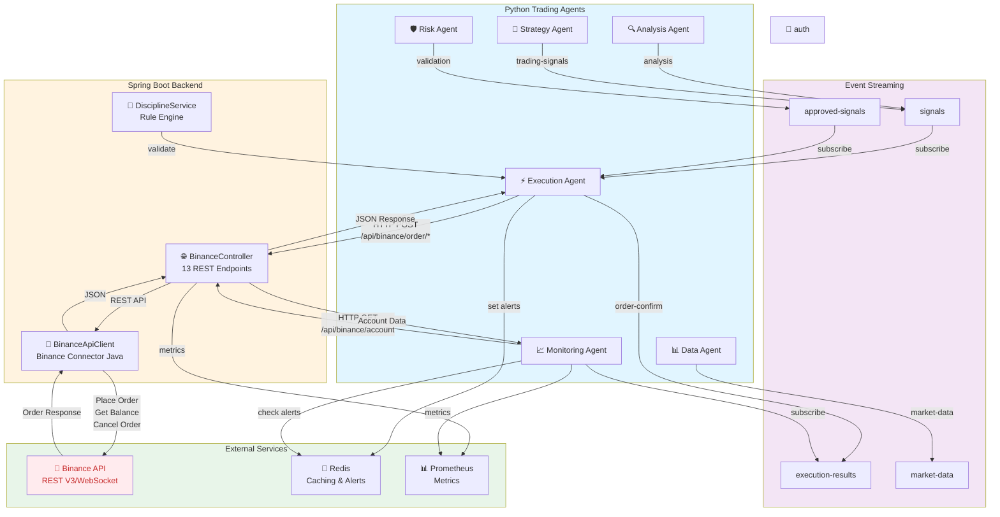

This diagram shows:
- **Python Agents** → Send trading signals and orders via Kafka
- **Spring Boot Backend** → Exposes REST API and manages Binance connections
- **BinanceApiClient** → Handles Binance API authentication and communication
- **Binance API** → Executes orders and retrieves market data
- **Event Streaming** → Kafka topics for inter-agent communication
- **External Services** → Redis for caching, Prometheus for metrics
