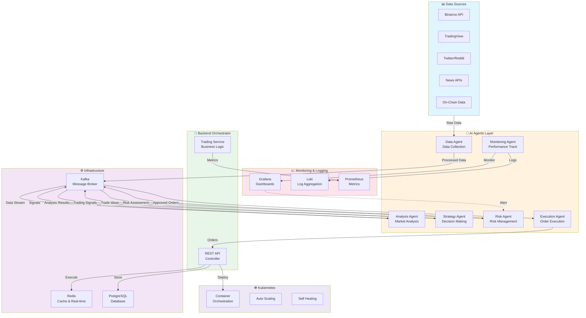

# 🤖 AI Multi-Agent Trading System

Hệ thống trading tự động với kiến trúc Multi-AI Agent cho chứng khoán và crypto.

## 🏗️ Kiến trúc

```
Market Data → Analysis → Strategy → Risk Check → Execute → Monitor
```

### 🧠 AI Agents

1. **Data Agent** - Thu thập dữ liệu real-time
   - Giá (Binance, TradingView)
   - Tin tức (Twitter, Reddit, News)
   - On-chain data (crypto)

2. **Analysis Agent** - Phân tích thị trường
   - Technical Analysis (RSI, MACD, EMA, Bollinger Bands)
   - Sentiment Analysis (AI đọc tin tức, social media)
   - Pattern Recognition (ML models)

3. **Strategy Agent** - Quyết định trading
   - Buy / Sell / Hold signals
   - Risk level assessment
   - Position sizing

4. **Risk Management Agent** - Quản lý rủi ro
   - Stop loss / Take profit
   - Max drawdown control
   - Portfolio allocation

5. **Execution Agent** - Thực thi lệnh
   - Binance API
   - Stock broker API
   - Order management

6. **Monitoring Agent** - Giám sát hệ thống
   - Performance tracking
   - Alerting (Grafana)
   - Logging (Loki)

## 🔧 Tech Stack

### Backend
- **Java Spring Boot** - Orchestrator service
- **Python** - AI/ML agents
- **Kafka** - Message broker
- **Redis** - Cache & real-time data

### AI/ML
- **OpenAI GPT** - Sentiment analysis
- **LangChain** - Agent orchestration
- **TensorFlow/PyTorch** - Price prediction models
- **scikit-learn** - Technical indicators

### Infrastructure
- **Kubernetes** - Container orchestration
- **Docker** - Containerization
- **Helm** - K8s package manager
- **Grafana/Loki** - Monitoring & Logging

### APIs
- **Binance API** - Crypto trading
- **TradingView API** - Market data
- **Twitter/Reddit API** - Sentiment data

## 📁 Project Structure

```
AIAgentsTrading/
├── backend/                    # Spring Boot orchestrator
│   ├── src/main/java/
│   │   └── com/trading/orchestrator/
│   │       ├── controller/     # REST APIs
│   │       ├── service/        # Business logic
│   │       ├── model/          # Data models
│   │       └── config/         # Configuration
│   └── build.gradle.kts
│
├── agents/                     # Python AI agents
│   ├── data_agent/            # Data collection
│   ├── analysis_agent/        # Market analysis
│   ├── strategy_agent/        # Trading strategy
│   ├── risk_agent/            # Risk management
│   ├── execution_agent/       # Order execution
│   └── monitoring_agent/      # System monitoring
│
├── ml-models/                  # Machine learning models
│   ├── price_prediction/
│   ├── sentiment_analysis/
│   └── pattern_recognition/
│
├── infrastructure/             # K8s & Docker
│   ├── docker/
│   ├── kubernetes/
│   └── helm/
│
└── configs/                    # Configuration files
    ├── application.yml
    ├── kafka.yml
    └── redis.yml
```

## 🚀 Quick Start

### Prerequisites
```bash
- Java 17+
- Python 3.10+
- Docker & Kubernetes
- Kafka
- Redis
```

### 1. Backend Setup
```bash
cd backend
./gradlew bootRun
```

### 2. Python Agents Setup
```bash
cd agents
pip install -r requirements.txt
python -m uvicorn main:app --reload
```

### 3. Docker Build
```bash
docker-compose up -d
```

### 4. Deploy to Kubernetes
```bash
cd infrastructure/helm
helm install ai-trading ./ai-trading-chart
```

## 📊 Trading Strategies

### 1. Technical + AI Hybrid
- RSI + MACD + LSTM model
- Dễ implement, hiệu quả ổn định

### 2. Sentiment Trading
- AI đọc Twitter, Reddit, News
- Detect FOMO, Panic, Trends

### 3. Reinforcement Learning
- AI tự học từ market data
- Advanced level

## 🔐 Security

- API keys stored in Kubernetes Secrets
- Encrypted communication
- Rate limiting
- Risk limits enforced

## 📈 Performance Monitoring

- Real-time metrics (Grafana)
- Trade logs (Loki)
- Alert system (Slack/Email)
- Backtesting reports

## 🛠️ Development

### Run Tests
```bash
# Backend
./gradlew test

# Python agents
pytest agents/
```

### Build Docker Images
```bash
./build-all-images.sh
```

## 📝 Configuration

Edit `configs/application.yml`:
```yaml
trading:
  mode: paper  # paper or live
  risk:
    max-position-size: 0.1  # 10% per trade
    stop-loss: 0.02         # 2%
```

## 🤝 Contributing

1. Fork the repo
2. Create feature branch
3. Commit changes
4. Push to branch
5. Create Pull Request

## 📄 License

MIT License

## 🔗 Links

- [Documentation](./docs/)
- [API Reference](./docs/api.md)
- [Trading Strategies](./docs/strategies.md)

---
**⚠️ Disclaimer**: Trading involves substantial risk. Use at your own risk.


# AIAgentsTrading
