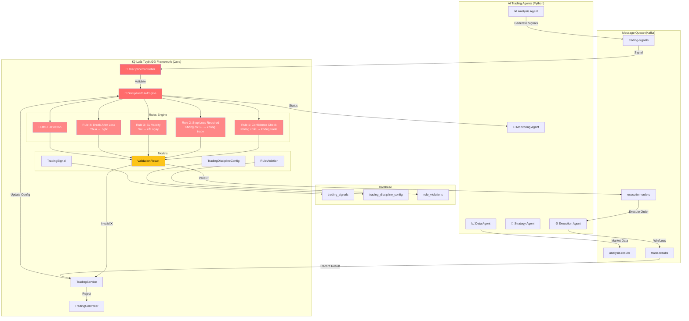
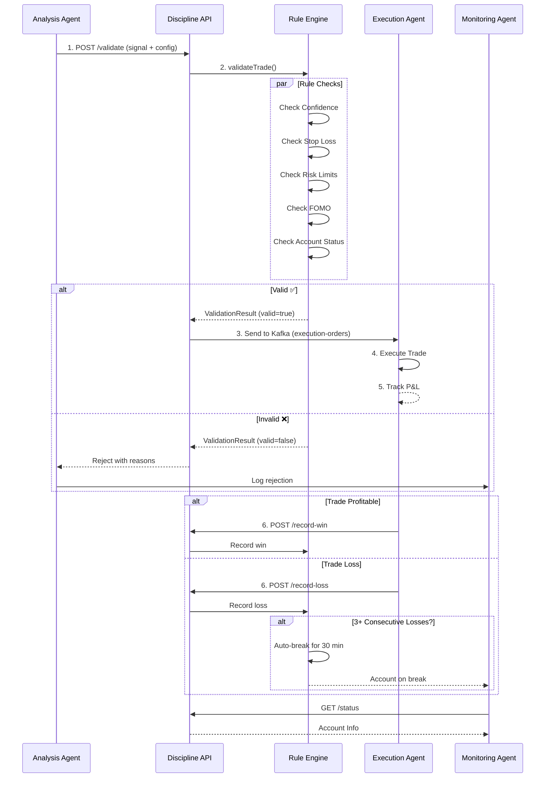
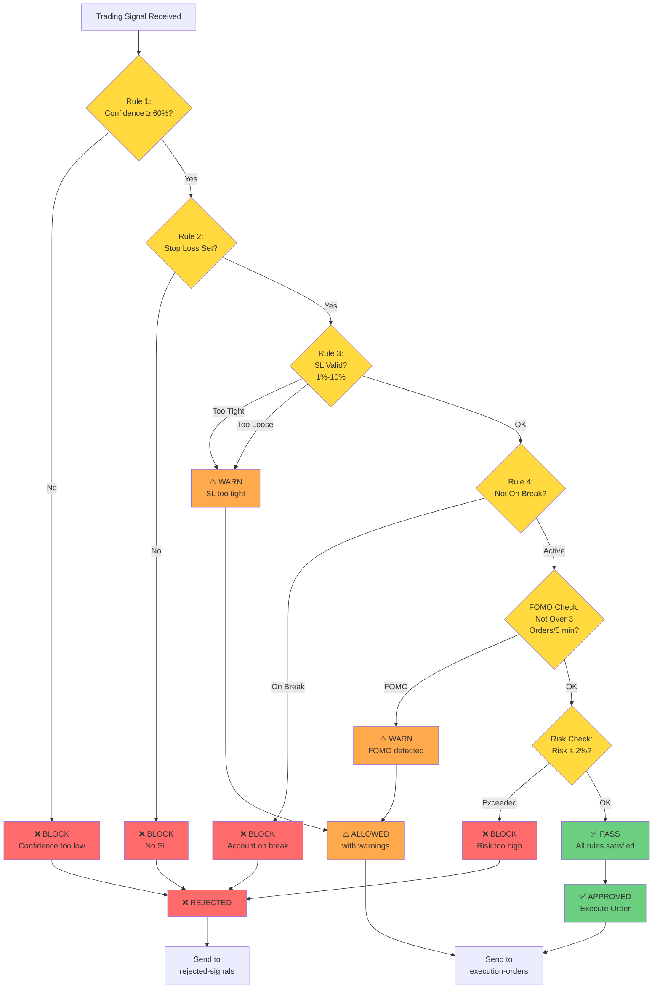
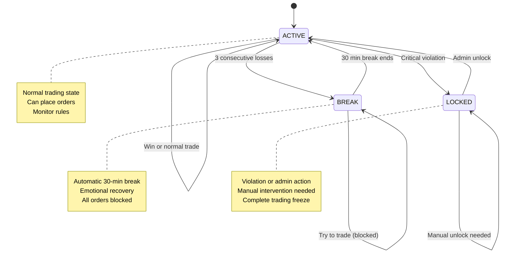
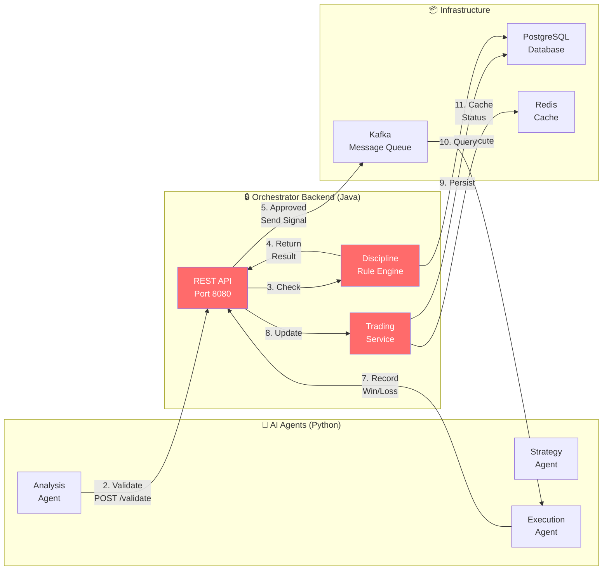

## Architecture Overview



## Rule Enforcement Flow



## Auto-Break Process

```mermaid
timeline
    title Auto-Break Trigger (3 Consecutive Losses)
    
    15:00 : Trade 1 : LOSS -$100
          : Consecutive Losses: 1
          : Status: ACTIVE
          
    15:15 : Trade 2 : LOSS -$150
          : Consecutive Losses: 2
          : Status: ACTIVE
          
    15:30 : Trade 3 : LOSS -$200
          : Consecutive Losses: 3 ← TRIGGER!
          : AUTO-LOCK activated
          : Break until 16:00
          
    15:30~16:00 : BREAK PERIOD
               : ❌ All orders blocked
               : "Bạn đang trong kỳ nghỉ!"
               : Emotional recovery
               
    16:00 : Break ends
         : Manual: POST /resume
         : Consecutive losses reset
         : Status: ACTIVE
         
    16:05 : User ready
         : Can trade again
         : Fresh start!
```

## Dashboard State Machine



## Integration Architecture


